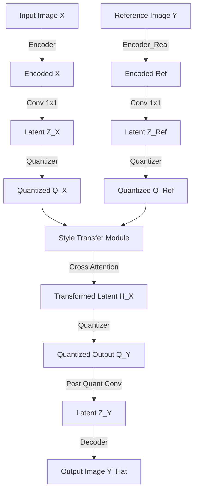

# Model Architecture

This document details the architectural components of the QuantArt implementation. The system is built upon a VQGAN framework with an additional Style Transfer Module operating in the latent space.

## Class Hierarchy

- `pl.LightningModule` (PyTorch Lightning Base)
  - `VQModel_Ref` (`taming/models/vqgan_ref.py`) - **Main Orchestrator**
    - `Encoder` (`taming/modules/diffusionmodules/model.py`) - **Content Encoder**
    - `Encoder` (`taming/modules/diffusionmodules/model.py`) - **Reference/Style Encoder**
    - `VectorQuantizer2` (`taming/modules/vqvae/quantize.py`) - **Quantization**
    - `StyleTransferModule` (`taming/modules/diffusionmodules/model.py`) - **Latent Transformation**
      - `StyleTransferBlock` (Sequential Blocks)
        - `ResnetBlock`
        - `AttnBlock` (Self-Attention)
        - `AttnBlock` (Cross-Attention with Reference)
    - `Decoder` (`taming/modules/diffusionmodules/model.py`) - **Generator**

## Data Flow & Tensor Shapes

The following diagram illustrates the forward pass during the style transfer process (`transfer` method in `VQModel_Ref`).

### Tensor Shape Tracking (Example Resolution: 256x256)

Assuming `ddconfig` with `z_channels=256`, `ch_mult=[1,1,2,2,4]`, `attn_resolutions=[16]`:

1.  **Input**: `x`: $[B, 3, 256, 256]$
2.  **Encoder Output**: `h = self.encoder(x)`
    - Downsamples by factor $2^4 = 16$ (due to `num_resolutions=5` but last level usually effectively 16x downsampling in standard VQGAN configs, check `ch_mult` length).
    - If `ch_mult` is `[1,1,2,2,4]`, len is 5.
    - Shape: $[B, 256, 16, 16]$ (assuming 256 channels).
3.  **Quant Conv**: `h = self.quant_conv(h)`
    - Shape: $[B, \text{embed\_dim}, 16, 16]$.
4.  **Quantization**: `quant, _, _ = self.quantize_enc(h)`
    - Shape: $[B, \text{embed\_dim}, 16, 16]$.
    - Indices: $[B, 16, 16]$ (flattened $B \cdot 256$).
5.  **Style Transfer Module**: `h_x = self.model_x2y(quant_x, quant_ref)`
    - Input: `quant_x` $[B, 256, 16, 16]$, `quant_ref` $[B, 256, 16, 16]$.
    - Operation: Preserves spatial dimensions.
    - Output: `h_x` $[B, 256, 16, 16]$.
6.  **Decoder**: `dec = self.decoder(quant)`
    - Upsamples back to original resolution.
    - Output: $[B, 3, 256, 256]$.

## Component Details

### Style Transfer Module (`taming/modules/diffusionmodules/model.py`)

This is the core novelty. It consists of `block_num` (default 6) layers of `StyleTransferBlock`.
Each block applies:

1.  **ResnetBlock**: Local processing.
2.  **Self-Attention**: Global context within the content image.
3.  **Cross-Attention**: Attends to the Reference `quant_ref` to inject style information.

### Vector Quantizer (`taming/modules/vqvae/quantize.py`)

Uses `VectorQuantizer2`. It maintains a codebook (embedding table).

- **Forward**: Finds nearest neighbor in codebook for each spatial vector.
- **Backward**: Uses straight-through estimator (gradient copied from quantized to continuous input).
